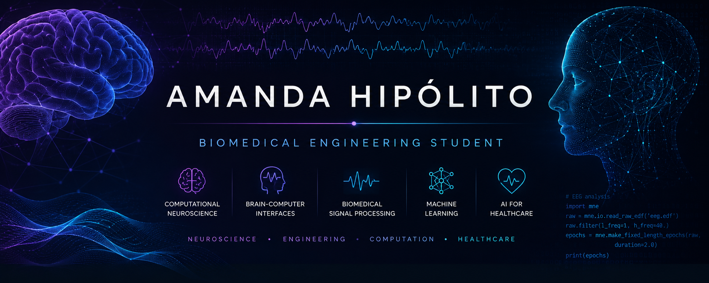

<p align="center">
  
</p>

<h1 align="center">Amanda Cruz Hipólito</h1>

<p align="center">
  <b>Biomedical Engineering Student</b>
</p>

<p align="center">
  Computational Neuroscience • Biomedical Signal Processing • Brain-Computer Interfaces • AI for Healthcare
</p>

<p align="center">
  
</p>

---

## About Me

I am a Biomedical Engineering student interested in the intersection of neuroscience, engineering and computation.

My academic interests include computational neuroscience, biomedical signal processing, brain-computer interfaces, machine learning and digital image processing.

Currently, I am developing projects involving EEG analysis, neural signal classification and computational methods applied to healthcare technologies.

---

## Research Interests

🧠 Computational Neuroscience

📡 Brain-Computer Interfaces (BCI)

📈 Biomedical Signal Processing

🤖 Machine Learning

🖼️ Digital Image Processing

🩺 Artificial Intelligence for Healthcare

🔬 Biomedical Engineering

---

## Current Projects

### EEG-Based Brain-Computer Interface

Development of machine learning pipelines for EEG classification using:

- Signal preprocessing
- Notch and band-pass filtering
- Independent Component Analysis (ICA)
- Common Spatial Patterns (CSP)
- Support Vector Machines (SVM)
- Cross-validation and robustness analysis

### Digital Image Processing

Implementation of classical image processing techniques including:

- Intensity transformations
- Spatial filtering
- Edge detection
- Segmentation
- Mathematical morphology

---

## Technologies

<p align="center">


</p>

<p align="center">


</p>

---

## GitHub Statistics

<p align="center">


</p>

---

## Learning Journey

```text
Biomedical Engineering      ████████░░
Signal Processing           ███████░░░
Machine Learning            ██████░░░░
Computational Neuroscience  ██████░░░░
Digital Image Processing    ██████░░░░
Scientific Research         ███████░░░
